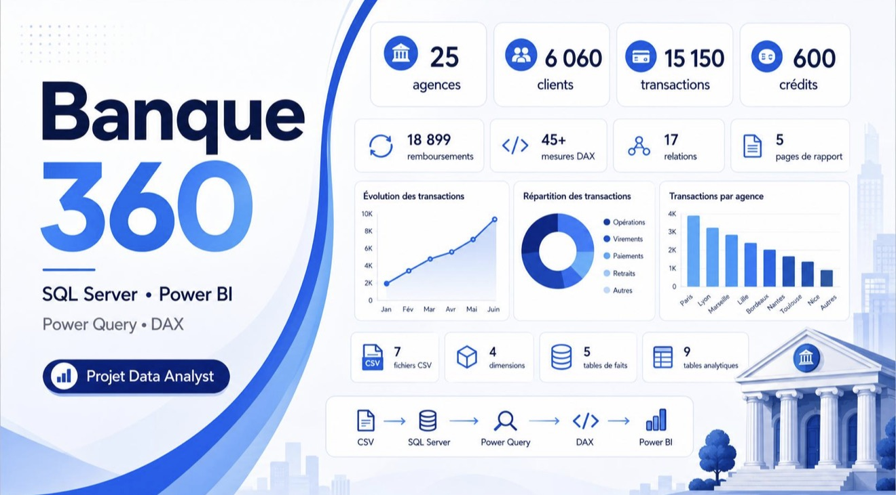
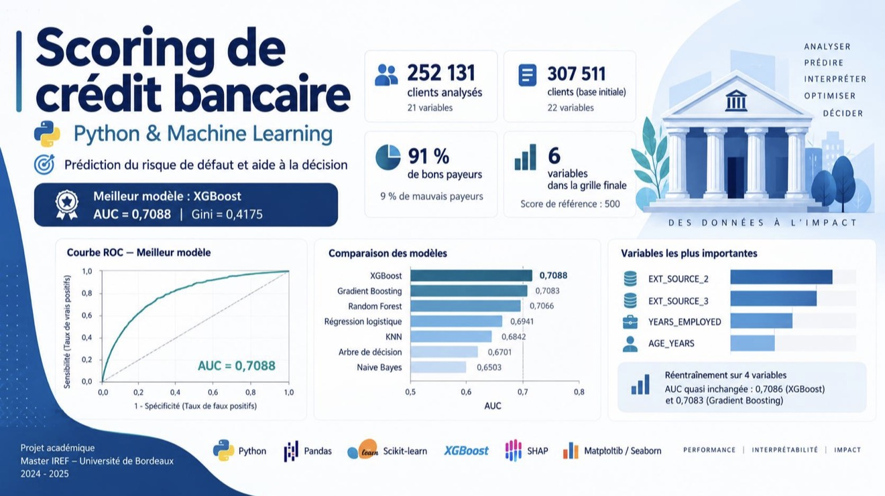
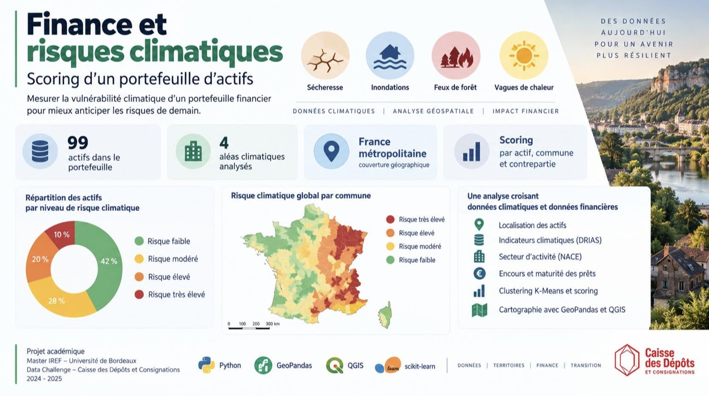
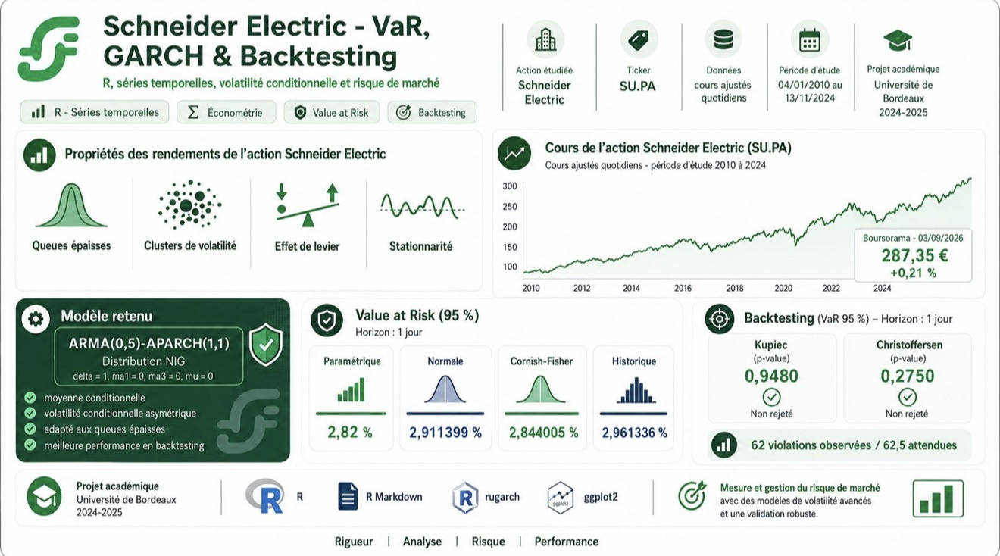
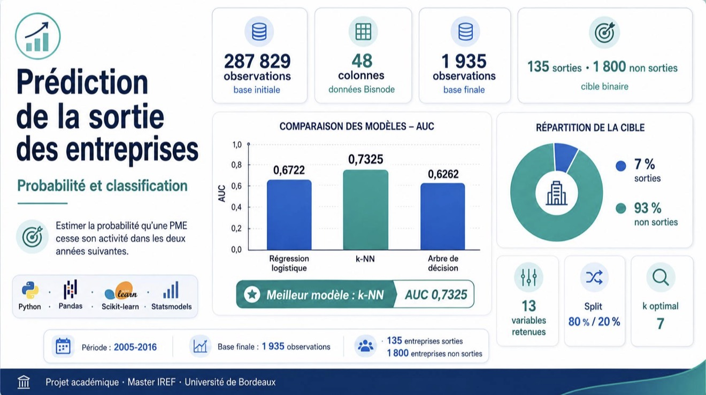
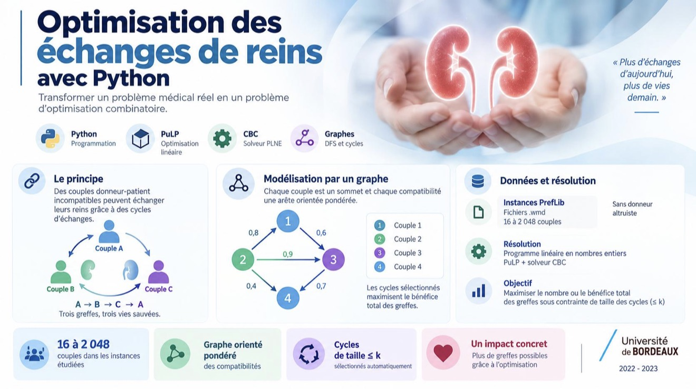

  

<h1 align="center">Benjamin Baillet</h1>

  <strong>Data Analyst | Business Intelligence | Finance Quantitative</strong>

  Transformer des données complexes en informations fiables, lisibles et utiles à la décision.

  
  

  <a href="#profil">Profil</a> ·
  <a href="#expertise">Expertise</a> ·
  <a href="#projets-sélectionnés">Projets</a> ·
  <a href="#expérience">Expérience</a> ·
  <a href="#formation">Formation</a> ·
  <a href="#contact">Contact</a>

---

# Profil

Diplômé d’un **Master Ingénierie des Risques Économiques et Financiers, parcours Finance Quantitative & Actuariat**, et d’une **Licence en Ingénierie Mathématique**, je développe des projets à l’intersection de la **Data Analysis**, de la **Business Intelligence**, du **Data Engineering** et de la **modélisation quantitative**.

Mon approche consiste à partir d’un besoin ou de données brutes, puis à construire une chaîne d’analyse cohérente :

**Comprendre le besoin → structurer les données → contrôler leur qualité → analyser → modéliser → visualiser → expliquer**

Lors de mon expérience de **Data Analyst chez Orange Pro PME**, j’ai travaillé sur les données de plus de **17 000 entreprises** et développé des traitements automatisés destinés à fiabiliser, analyser et restituer l’information aux équipes métier.

Je m’intéresse particulièrement aux environnements dans lesquels la donnée contribue directement à la **prise de décision**, au **pilotage de la performance** et à la **gestion des risques**.

---

# Ma façon de travailler

| | |
|---|---|
| **Rigueur analytique** | Vérifier, nettoyer et contrôler les données avant toute interprétation. |
| **Esprit d’analyse** | Transformer une problématique métier en indicateurs, analyses ou modèles exploitables. |
| **Autonomie** | Concevoir un projet complet, de la donnée brute jusqu’à la restitution finale. |
| **Curiosité technique** | Explorer de nouveaux outils et comparer plusieurs approches avant de retenir une solution. |
| **Pédagogie** | Présenter clairement des résultats techniques à des interlocuteurs non spécialistes. |
| **Adaptabilité** | Travailler dans des environnements, équipes et contextes très différents. |

---

# Quelques repères

| 17 000+ entreprises | 252 131 clients | 45 mesures DAX | 99 actifs | TOEIC 830/990 |
|:---:|:---:|:---:|:---:|:---:|
| Analysées chez Orange | Projet scoring crédit | Projet Banque 360 | Data Challenge | Avant immersion internationale |

---

# Expertise

## Data Analysis & Machine Learning

Analyse exploratoire, préparation des données, classification, clustering, séries temporelles, scoring, économétrie et modélisation quantitative.

## Business Intelligence

Conception de tableaux de bord, indicateurs de pilotage, mesures DAX, analyse métier, restitution et data visualisation.

## Data Engineering & bases de données

Architecture RAW / STAGING / MART, nettoyage, transformations, contrôles qualité, modélisation dimensionnelle, contraintes, index et documentation.

---

# Projets sélectionnés

## Banque 360 - SQL Server & Power BI

  

> Concevoir une chaîne décisionnelle bancaire complète, depuis les données brutes jusqu’au reporting Power BI.

**SQL Server · Power BI · DAX · Docker · Data Quality · Modélisation en étoile**

Projet personnel construit intégralement en autonomie à partir de **7 jeux de données fictifs et réalistes**.

`RAW → STAGING → MART → REPORTING → POWER BI`

Le projet comprend notamment :

- import et structuration des données
- nettoyage et normalisation
- contrôles de qualité
- construction des dimensions et tables de faits
- modélisation en étoile
- contraintes et index SQL
- vues de reporting
- environ **45 mesures DAX**
- tableaux de bord consacrés aux clients, transactions, crédits, risques et agences
- documentation complète de l’architecture

**[Explorer Banque 360](https://github.com/benjaminblt/Banque360_SQL_PowerBI)**

---

## Scoring du risque de crédit

  

> Étudier le risque de crédit à partir de données clients et comparer plusieurs approches de Machine Learning.

**Python · Pandas · Scikit-learn · Machine Learning · Scoring**

Analyse de **252 131 clients**, préparation des données, construction d’une grille de score et comparaison de modèles de classification interprétables.

Le projet met l’accent sur la préparation des variables, l’évaluation des modèles et l’interprétation des résultats dans un contexte de risque bancaire.

**[Explorer le projet](https://github.com/benjaminblt/Prediction_Risque_Credit)**

---

## Data Challenge - Caisse des Dépôts

  

> Mesurer et cartographier l’exposition d’un portefeuille immobilier aux risques climatiques.

**Python · QGIS · K-Means · Cartographie · Risques climatiques**

Analyse de quatre risques climatiques, construction d’indicateurs territoriaux, segmentation par K-Means, cartographie et agrégation pondérée des risques sur un portefeuille de **99 actifs**.

Le projet combine analyse quantitative et approche géographique afin de produire une lecture synthétique de l’exposition du portefeuille.

**[Explorer le projet](https://github.com/benjaminblt/Data_Challenge_Caisse_des_Depots)**

---

## Risque de marché - VaR, GARCH & Backtesting

  

> Modéliser la volatilité financière et mesurer le risque de marché à l’aide d’approches économétriques.

**Séries temporelles · Économétrie · GARCH · Value at Risk · Backtesting**

Analyse des rendements financiers, étude de la volatilité, estimation de la Value at Risk et évaluation des modèles à travers des procédures de backtesting.

Ce projet mobilise des outils directement issus de ma formation en **finance quantitative et gestion des risques**.

**[Explorer le projet](https://github.com/benjaminblt/Rendements_et_Value_At_Risk)**

---

## Prédiction de sortie d'entreprise

  

> Comparer plusieurs modèles de classification pour détecter les entreprises susceptibles de sortir d’un portefeuille.

**Python · Classification · Régression logistique · k-NN · Arbre de décision**

Préparation et nettoyage de données comptables, construction de plusieurs modèles de classification et comparaison des performances à l’aide de l’AUC.

Le projet porte autant sur la qualité de préparation des données que sur le choix et l’évaluation du modèle.

**[Explorer le projet](https://github.com/benjaminblt/Prediction_Sortie_Entreprise)**

---

## Optimisation des échanges de reins

  

> Modéliser un problème réel d’allocation sous forme de problème d’optimisation combinatoire.

**Python · Optimisation combinatoire · PLNE · DFS · Théorie des graphes**

Modélisation du **Kidney Exchange Problem**, représentation des compatibilités sous forme de graphe, génération de cycles par parcours DFS puis sélection optimale par programmation linéaire en nombres entiers.

Ce projet illustre l’utilisation de méthodes mathématiques et algorithmiques pour résoudre un problème concret sous contraintes.

**[Explorer le projet](https://github.com/benjaminblt/Probleme_Echange_De_Reins)**

---

# Expérience

## Data Analyst - Orange Pro PME

Travail sur un périmètre de plus de **17 000 entreprises** afin d’identifier, fiabiliser et restituer des informations utiles aux équipes commerciales.

Principales réalisations :

- collecte et croisement de données provenant de plusieurs sources
- automatisation de traitements avec Python
- nettoyage et contrôle qualité
- analyse de données économiques et d’entreprises
- identification de **129 clients à risque**
- anticipation de certaines situations jusqu’à **2 mois**
- création de **10 cartographies interactives**
- production d’analyses destinées aux équipes métier
- utilisation de Python, R, Excel, QlikView et SharePoint

Cette expérience m’a appris à relier une problématique Data à un besoin opérationnel concret, avec une attention particulière portée à la **fiabilité des données** et à la **lisibilité des résultats**.

---

# Formation

## Master Ingénierie des Risques Économiques et Financiers

**Parcours Finance Quantitative & Actuariat**  
Université de Bordeaux

Formation centrée notamment sur :

- finance quantitative
- économétrie
- gestion des risques
- séries temporelles
- statistiques
- programmation
- modélisation

## Licence Ingénierie Mathématique - Mention Bien

Université de Bordeaux

Formation en mathématiques appliquées, statistiques, informatique et modélisation.

---

# Transmission & pédagogie

En parallèle de mon parcours universitaire, j’ai également exercé comme **professeur particulier de mathématiques**.

Cette expérience m’a appris à adapter mon discours, expliquer simplement des notions complexes et identifier rapidement les points de blocage.

Cette dimension pédagogique occupe aujourd’hui une place importante dans ma manière de travailler avec la donnée : une analyse n’a réellement de valeur que si elle peut être **comprise et utilisée**.

---

# International

Après mes études, j’ai consacré une année à une expérience internationale, notamment en **Australie puis en Asie**.

Travail, bénévolat, déplacements et immersion dans des environnements multiculturels ont renforcé mon autonomie, mon adaptabilité et mon aisance dans des contextes nouveaux.

**TOEIC : 830/990**, obtenu avant cette immersion internationale.

---

# Objectif professionnel

Je souhaite poursuivre mon parcours dans la **Data Analysis** et la **Business Intelligence**, avec un intérêt particulier pour les environnements où la donnée intervient directement dans la prise de décision.

Je souhaite notamment travailler sur des problématiques liées à :

- l’analyse et la valorisation des données
- la Business Intelligence
- l’automatisation des traitements
- la qualité et la fiabilisation des données
- le reporting et le pilotage de la performance
- la modélisation
- l’aide à la décision
- la finance, la banque, l’assurance et la gestion des risques

---

# Contact

### Benjamin Baillet

**Data Analyst | Business Intelligence | Finance Quantitative**

Bordeaux, France

[LinkedIn](https://www.linkedin.com/in/benjamin-baillet/)  
[benjaminbaillet@icloud.com](mailto:benjaminbaillet@icloud.com)

 

**Data is useful when it becomes understandable, reliable and actionable.**

