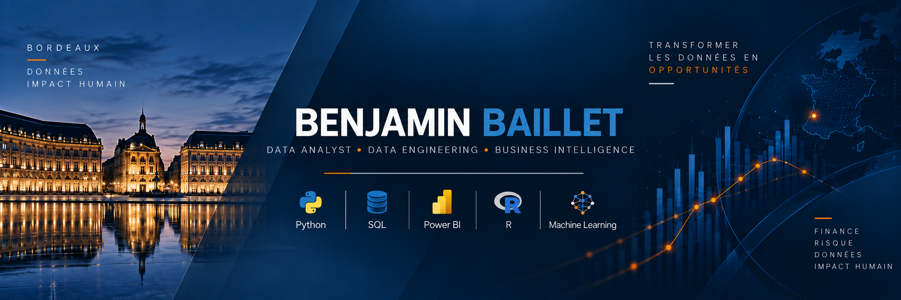

  

---

## À propos

Diplômé d’un **Master en Finance Quantitative & Actuariat** et d’une
**Licence en Ingénierie Mathématique**, je développe des projets à
l’intersection de la **Data Analysis, du Data Engineering, de la
Business Intelligence et de la modélisation quantitative**.

Lors de mon expérience de **Data Analyst chez Orange Pro PME**, j’ai
travaillé sur les données de plus de **17 000 entreprises** et développé
un pipeline Python automatisé de collecte, traitement, contrôle qualité,
analyse et visualisation.

J’aime particulièrement partir de données brutes, les structurer,
contrôler leur qualité, les analyser puis transformer les résultats
en informations réellement exploitables.

---

## Stack

### Data Analysis & Machine Learning

### Business Intelligence

### Data Engineering & outils

---

# Projets sélectionnés

## Banque 360 — SQL Server & Power BI

**Pipeline Data complet • Modélisation décisionnelle • Data Quality • Reporting**

Projet personnel construit intégralement en autonomie à partir de
**7 jeux de données fictifs et réalistes**.

`RAW → STAGING → MART → REPORTING → POWER BI`

- SQL Server sous Docker
- nettoyage et transformation des données
- contrôles qualité
- modèle en étoile
- dimensions et tables de faits
- vues, contraintes et index
- environ **45 mesures DAX**
- dashboards clients, transactions, crédits, risques et agences
- documentation complète du projet

➡️ [Découvrir Banque 360](https://github.com/benjaminblt/Banque360_SQL_PowerBI)

---

## Scoring du risque de crédit

**Python • Pandas • Scikit-learn • Machine Learning**

Analyse de **252 131 clients**, construction d’une grille de score
et comparaison de modèles de Machine Learning interprétables.

➡️ [Voir le projet](https://github.com/benjaminblt/Prediction_Risque_Credit)

---

## Data Challenge — Caisse des Dépôts

**Python • QGIS • K-Means • Risques climatiques**

Analyse de quatre risques climatiques, scoring par commune,
segmentation K-Means, cartographie et agrégation pondérée
d’un portefeuille de **99 actifs**.

➡️ [Voir le projet](https://github.com/benjaminblt/Data_Challenge_Caisse_des_Depots)

---

## Risque de marché — VaR, GARCH & Backtesting

**Séries temporelles • Économétrie • Risque financier**

Analyse économétrique des rendements financiers,
modélisation de la volatilité et estimation de la Value at Risk.

➡️ [Voir le projet](https://github.com/benjaminblt/Rendements_et_Value_At_Risk)

---

## Prédiction de sortie d'entreprise

**Python • Classification • Machine Learning**

Nettoyage de données comptables, régression logistique,
k-NN, arbre de décision et comparaison des modèles par AUC.

➡️ [Voir le projet](https://github.com/benjaminblt/Prediction_Sortie_Entreprise)

---

## Optimisation des échanges de reins

**Python • Optimisation combinatoire • PLNE**

Modélisation du Kidney Exchange Problem, génération de cycles
par DFS et résolution par programmation linéaire en nombres entiers.

➡️ [Voir le projet](https://github.com/benjaminblt/Probleme_Echange_De_Reins)

---

## Expérience

### Data Analyst — Orange Pro PME

- analyse et fiabilisation des données de **17 000+ entreprises**
- pipeline Python automatisé
- détection de **129 clients à risque**
- anticipation de certaines situations jusqu’à **2 mois**
- création de **10 cartographies interactives**
- Python, R, Excel, QlikView et SharePoint
- restitution aux équipes métier

---

## Formation

**Master Ingénierie des Risques Économiques et Financiers**  
Finance Quantitative & Actuariat — Université de Bordeaux

**Licence Ingénierie Mathématique — Mention Bien**  
Université de Bordeaux

---

## International

Après mes études, j’ai consacré une année à une expérience internationale,
notamment en Australie puis en Asie.

Travail, bénévolat, environnements multiculturels et immersion en anglais
ont renforcé mon **autonomie, mon adaptabilité et ma capacité à travailler
avec des profils très différents**.

**TOEIC : 830/990**, obtenu avant cette immersion internationale.

---

### Me contacter

📍 Bordeaux  
📧 [benjaminbaillet@icloud.com](mailto:benjaminbaillet@icloud.com)  
💼 [LinkedIn](https://www.linkedin.com/in/benjamin-baillet/)

